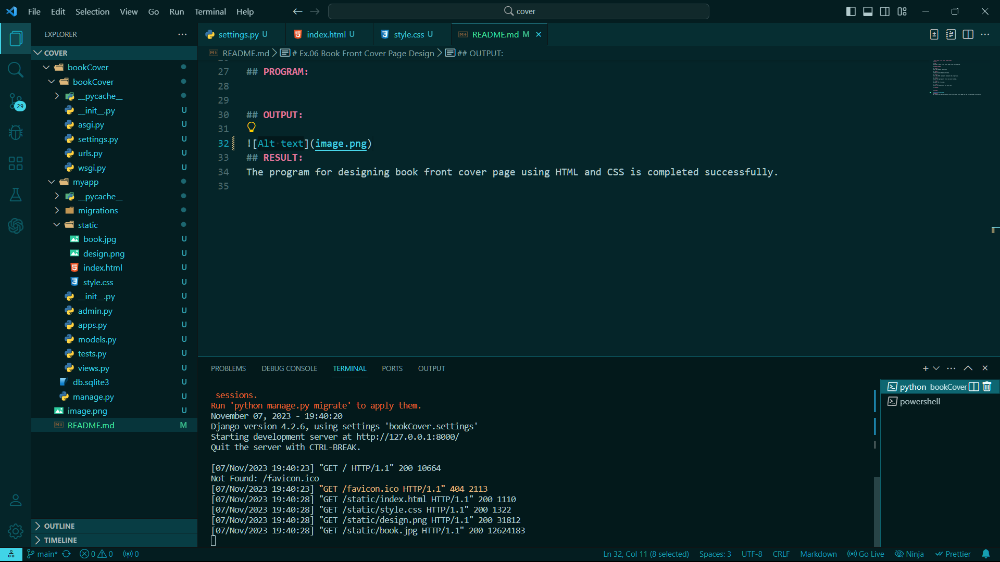
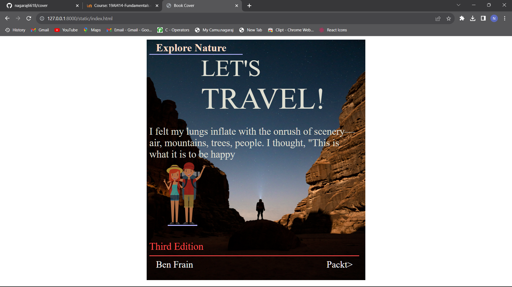

# Ex.06 Book Front Cover Page Design
## Date:

## AIM:
To design a book front cover page using HTML and CSS.

## DESIGN STEPS:

### Step 1:
Clone the GitHub repository.

### Step 2:
Create a Django Admin interface.

### Step 3:
Write the HTML code with relevant CSS properties.

### Step 4:
Choose the appropriate style and color scheme.

### Step 5:
Validate the HTML code.

### Step 6:
Publish the website in the given URL.

## PROGRAM:
```html
<!DOCTYPE html>
<html lang="en">

<head>
   <meta charset="UTF-8">
   <meta name="viewport" content="width=device-width, initial-scale=1.0">
   <link rel="stylesheet" href="style.css">
   <title>Book Cover</title>
</head>

<body>
   <div class="book-container">
      <div class="image-container">
         
      </div>
      <div class="body-book">
         <h1>Explore Nature</h1>
         <div class="line"></div>
         <span class="book-title">LET'S</span>
         <p class="book-title Travel">TRAVEL!</p>
         <p class="content">I felt my lungs inflate with the onrush of scenery—air, mountains, trees, people. I thought,
            "This is what it is to be happy</p>
         
         <div class="line1"></div>
         <p class="book-edition">Third Edition</p>
         <div class="line2"></div>
         <div class="name-container">
    
            <p class="name">Ben Frain</p>
            <p class="name">Packt></p>
         </div>
      </div>
   </div>
</body>

</html>
```

## OUTPUT:


## RESULT:
The program for designing book front cover page using HTML and CSS is completed successfully.
